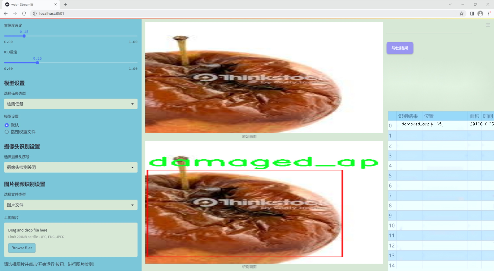
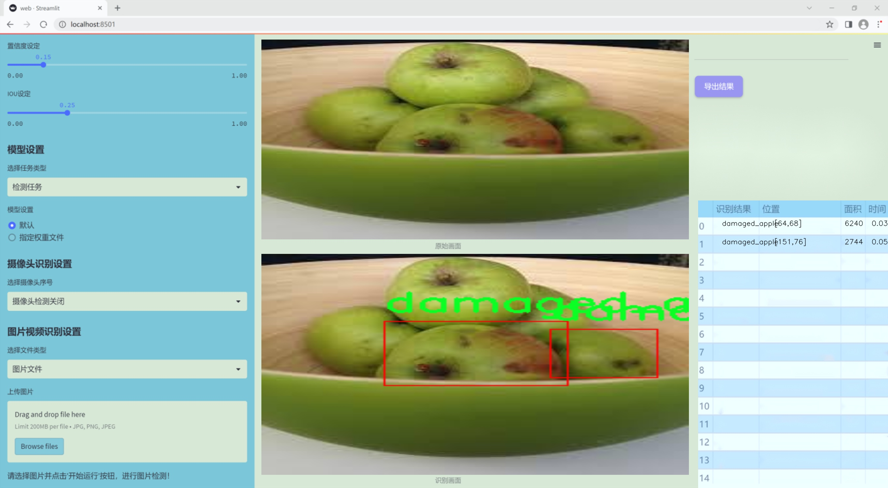
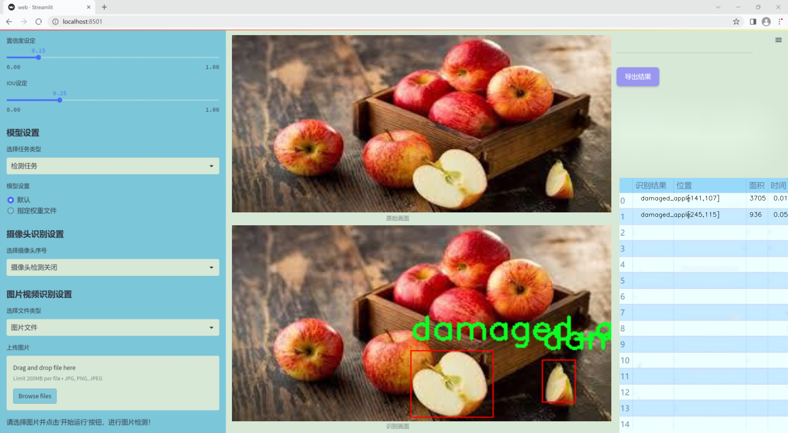
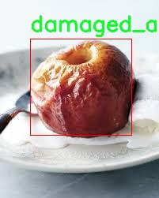
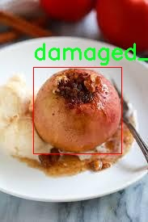
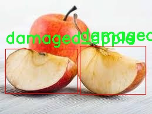

# 改进yolo11-CSwinTransformer等200+全套创新点大全：损伤苹果检测系统源码＆数据集全套

### 1.图片效果展示







##### 项目来源 **[人工智能促进会 2024.10.22](https://kdocs.cn/l/cszuIiCKVNis)**

##### 注意：由于项目一直在更新迭代，上面“1.图片效果展示”和“2.视频效果展示”展示的系统图片或者视频可能为老版本，新版本在老版本的基础上升级如下：（实际效果以升级的新版本为准）

  （1）适配了YOLOV11的“目标检测”模型和“实例分割”模型，通过加载相应的权重（.pt）文件即可自适应加载模型。

  （2）支持“图片识别”、“视频识别”、“摄像头实时识别”三种识别模式。

  （3）支持“图片识别”、“视频识别”、“摄像头实时识别”三种识别结果保存导出，解决手动导出（容易卡顿出现爆内存）存在的问题，识别完自动保存结果并导出到tempDir中。

  （4）支持Web前端系统中的标题、背景图等自定义修改。

  另外本项目提供训练的数据集和训练教程,暂不提供权重文件（best.pt）,需要您按照教程进行训练后实现图片演示和Web前端界面演示的效果。

### 2.视频效果展示

[2.1 视频效果展示](https://www.bilibili.com/video/BV1cpyZYJEj5/)

### 3.背景

研究背景与意义

随着全球农业生产的不断发展，果品的质量和安全性日益受到重视。苹果作为一种广泛种植和消费的水果，其市场需求量大，质量控制显得尤为重要。苹果在生长过程中容易受到多种病虫害的侵袭，导致果实损伤，影响其外观和食用价值。因此，及时、准确地检测损伤苹果，对于提高果品的市场竞争力和保障消费者的健康具有重要意义。

近年来，计算机视觉和深度学习技术的快速发展为果品检测提供了新的解决方案。YOLO（You Only Look Once）系列模型因其高效的实时检测能力，逐渐成为物体检测领域的主流选择。YOLOv11作为该系列的最新版本，具备更强的特征提取能力和更快的推理速度，适合在复杂的农业环境中应用。然而，现有的YOLOv11模型在处理特定果品损伤检测时，仍存在一定的局限性，尤其是在针对特定类别的损伤特征识别上。

本研究旨在基于改进的YOLOv11模型，构建一个高效的损伤苹果检测系统。我们将利用包含697张苹果图像的数据集，专注于单一类别的损伤苹果进行训练和测试。通过对YOLOv11模型的改进，提升其在特定场景下的检测精度和鲁棒性，力求实现对损伤苹果的高效识别和分类。该系统的成功实施，不仅可以为果品分拣和质量控制提供技术支持，还将推动智能农业的发展，提高农业生产的自动化水平和效率，最终实现更高的经济效益和社会价值。

### 4.数据集信息展示

##### 4.1 本项目数据集详细数据（类别数＆类别名）

nc: 1
names: ['damaged_apple']


该项目为【目标检测】数据集，请在【训练教程和Web端加载模型教程（第三步）】这一步的时候按照【目标检测】部分的教程来训练

##### 4.2 本项目数据集信息介绍

本项目数据集信息介绍

本项目所使用的数据集名为“Apple Sorting”，旨在为改进YOLOv11的损伤苹果检测系统提供必要的训练数据。该数据集专注于对损伤苹果的识别与分类，具有重要的实际应用价值，尤其是在农业生产和食品安全领域。数据集中包含的类别数量为1，具体类别为“damaged_apple”，这意味着数据集的主要目标是帮助模型准确识别和检测受损的苹果，以便在后续的自动化分拣过程中进行有效的分类和处理。

“Apple Sorting”数据集的构建过程经过精心设计，确保了数据的多样性和代表性。数据集中包含了不同品种、不同程度损伤的苹果图像，这些图像不仅展示了各种损伤类型的特征，如表面划痕、腐烂、变色等，还考虑了不同的拍摄角度和光照条件，以增强模型的鲁棒性和适应性。此外，数据集中的图像均经过标注，确保每个损伤苹果的位置信息清晰可辨，为YOLOv11的训练提供了高质量的监督信号。

通过使用“Apple Sorting”数据集，改进后的YOLOv11模型将能够更有效地识别和分类损伤苹果，从而提高自动化分拣系统的效率和准确性。这不仅能够减少人工分拣的劳动强度，还能降低因损伤苹果带来的经济损失。综上所述，“Apple Sorting”数据集为本项目的成功实施奠定了坚实的基础，期待其在实际应用中发挥重要作用。









### 5.全套项目环境部署视频教程（零基础手把手教学）

[5.1 所需软件PyCharm和Anaconda安装教程（第一步）](https://www.bilibili.com/video/BV1BoC1YCEKi/?spm_id_from=333.999.0.0&vd_source=bc9aec86d164b67a7004b996143742dc)


[5.2 安装Python虚拟环境创建和依赖库安装视频教程（第二步）](https://www.bilibili.com/video/BV1ZoC1YCEBw?spm_id_from=333.788.videopod.sections&vd_source=bc9aec86d164b67a7004b996143742dc)

### 6.改进YOLOv11训练教程和Web_UI前端加载模型教程（零基础手把手教学）

[6.1 改进YOLOv11训练教程和Web_UI前端加载模型教程（第三步）](https://www.bilibili.com/video/BV1BoC1YCEhR?spm_id_from=333.788.videopod.sections&vd_source=bc9aec86d164b67a7004b996143742dc)


按照上面的训练视频教程链接加载项目提供的数据集，运行train.py即可开始训练



     Epoch   gpu_mem       box       obj       cls    labels  img_size
     1/200     20.8G   0.01576   0.01955  0.007536        22      1280: 100%|██████████| 849/849 [14:42<00:00,  1.04s/it]
               Class     Images     Labels          P          R     mAP@.5 mAP@.5:.95: 100%|██████████| 213/213 [01:14<00:00,  2.87it/s]
                 all       3395      17314      0.994      0.957      0.0957      0.0843

     Epoch   gpu_mem       box       obj       cls    labels  img_size
     2/200     20.8G   0.01578   0.01923  0.007006        22      1280: 100%|██████████| 849/849 [14:44<00:00,  1.04s/it]
               Class     Images     Labels          P          R     mAP@.5 mAP@.5:.95: 100%|██████████| 213/213 [01:12<00:00,  2.95it/s]
                 all       3395      17314      0.996      0.956      0.0957      0.0845

     Epoch   gpu_mem       box       obj       cls    labels  img_size
     3/200     20.8G   0.01561    0.0191  0.006895        27      1280: 100%|██████████| 849/849 [10:56<00:00,  1.29it/s]
               Class     Images     Labels          P          R     mAP@.5 mAP@.5:.95: 100%|███████   | 187/213 [00:52<00:00,  4.04it/s]
                 all       3395      17314      0.996      0.957      0.0957      0.0845


###### [项目数据集下载链接](https://kdocs.cn/l/cszuIiCKVNis)

### 7.原始YOLOv11算法讲解

YOLOv11是一种由Ultralytics公司开发的最新一代目标检测模型，以其增强的特征提取能力和更高的效率在计算机视觉领域引人注目。该模型在架构上进行了关键升级，通过更新主干和颈部结构，显著提高了对复杂视觉场景的理解和处理精度。YOLOv11不仅在目标检测上表现出色，还支持实例分割、图像分类、姿态估计和定向目标检测（OBB）等任务，展示出其多功能性。

与其前身YOLOv8相比，YOLOv11在设计上实现了深度和宽度的改变，同时引入了几个创新机制。其中，C3k2机制是对YOLOv8中的C2f的改进，提升了浅层特征的处理能力；C2PSA机制则进一步优化了特征图的处理流程。解耦头的创新设计，通过增加两个深度卷积（DWConv），提高了模型对细节的感知能力和分类准确性。

在性能上，YOLOv11m模型在COCO数据集上的平均精度（mAP）提高，并减少了22%的参数量，确保了在运算效率上的突破。该模型可以部署在多种平台上，包括边缘设备、云平台以及支持NVIDIA GPU的系统，彰显出卓越的灵活性和适应性。总体而言，YOLOv11通过一系列的创新突破，对目标检测领域产生了深远的影响，并为未来的开发提供了新的研究方向。


****文档**** ： _ _https://docs.ultralytics.com/models/yolo11/__

****代码链接**** ： _ _https://github.com/ultralytics/ultralytics__

******Performance Metrics******


​ ** **关键特性****

****◆**** ** **增强的特征提取能力**** ：YOLO11采用了改进的主干和颈部架构，增强了 ** **特征提取****
能力，能够实现更精确的目标检测和复杂任务的执行。

****◆**** ** **优化的效率和速度****
：YOLO11引入了精细化的架构设计和优化的训练流程，提供更快的处理速度，并在准确性和性能之间保持最佳平衡。

****◆**** ** **参数更少、精度更高****
：通过模型设计的改进，YOLO11m在COCO数据集上实现了更高的平均精度（mAP），同时使用的参数比YOLOv8m少22%，使其在计算上更加高效，而不牺牲准确性。

****◆**** ** **跨环境的适应性**** ：YOLO11可以无缝部署在各种环境中，包括边缘设备、云平台和支持NVIDIA
GPU的系统，确保最大的灵活性。

****◆**** ** **支持广泛任务****
：无论是目标检测、实例分割、图像分类、姿态估计还是定向目标检测（OBB），YOLO11都旨在应对一系列计算机视觉挑战。

****支持的任务和模式****


​YOLO11建立在YOLOv8中引入的多功能模型范围之上，为各种计算机视觉任务提供增强的支持:


​该表提供了YOLO11模型变体的概述，展示了它们在特定任务中的适用性以及与Inference、Validation、Training和Export等操作模式的兼容性。从实时检测到复杂的分割任务
，这种灵活性使YOLO11适用于计算机视觉的广泛应用。

##### yolov11的创新

■ yolov8 VS yolov11

YOLOv5，YOLOv8和YOLOv11均是ultralytics公司的作品，ultralytics出品必属精品。


​ **具体创新点** ：

**① 深度（depth）和宽度 （width）**

YOLOv8和YOLOv11是基本上完全不同。

**② C3k2机制**

C3k2有参数为c3k，其中在网络的浅层c3k设置为False。C3k2就相当于YOLOv8中的C2f。


​ **③ C2PSA机制**

下图为C2PSA机制的原理图。


​ **④ 解耦头**

解耦头中的分类检测头增加了两个 **DWConv** 。


▲Conv

    
    
    def autopad(k, p=None, d=1):  # kernel, padding, dilation
    
        """Pad to 'same' shape outputs."""
    
        if d > 1:
    
            k = d * (k - 1) + 1 if isinstance(k, int) else [d * (x - 1) + 1 for x in k]  # actual kernel-size
    
        if p is None:
    
            p = k // 2 if isinstance(k, int) else [x // 2 for x in k]  # auto-pad
    
    return p
    
    
    class Conv(nn.Module):
    
        """Standard convolution with args(ch_in, ch_out, kernel, stride, padding, groups, dilation, activation)."""
    
    
        default_act = nn.SiLU()  # default activation
    
    
        def __init__(self, c1, c2, k=1, s=1, p=None, g=1, d=1, act=True):
    
            """Initialize Conv layer with given arguments including activation."""
    
            super().__init__()
    
            self.conv = nn.Conv2d(c1, c2, k, s, autopad(k, p, d), groups=g, dilation=d, bias=False)
    
            self.bn = nn.BatchNorm2d(c2)
    
            self.act = self.default_act if act is True else act if isinstance(act, nn.Module) else nn.Identity()
    
    
        def forward(self, x):
    
            """Apply convolution, batch normalization and activation to input tensor."""
    
            return self.act(self.bn(self.conv(x)))
    
    
        def forward_fuse(self, x):
    
            """Perform transposed convolution of 2D data."""
    
            return self.act(self.conv(x))

▲Conv2d

    
    
    torch.nn.Conv2d(in_channels, out_channels, kernel_size, stride=1, padding=0, dilation=1, groups=1, bias=True, padding_mode='zeros')

▲DWConv

DWConv ** **代表 Depthwise Convolution（深度卷积）****
，是一种在卷积神经网络中常用的高效卷积操作。它主要用于减少计算复杂度和参数量。

    
    
    class DWConv(Conv):
    
        """Depth-wise convolution."""
    
    
        def __init__(self, c1, c2, k=1, s=1, d=1, act=True):  # ch_in, ch_out, kernel, stride, dilation, activation
    
            """Initialize Depth-wise convolution with given parameters."""
    
            super().__init__(c1, c2, k, s, g=math.gcd(c1, c2), d=d, act=act)


### 8.200+种全套改进YOLOV11创新点原理讲解

#### 8.1 200+种全套改进YOLOV11创新点原理讲解大全

由于篇幅限制，每个创新点的具体原理讲解就不全部展开，具体见下列网址中的改进模块对应项目的技术原理博客网址【Blog】（创新点均为模块化搭建，原理适配YOLOv5~YOLOv11等各种版本）

[改进模块技术原理博客【Blog】网址链接](https://gitee.com/qunmasj/good)


#### 8.2 精选部分改进YOLOV11创新点原理讲解

###### 这里节选部分改进创新点展开原理讲解(完整的改进原理见上图和[改进模块技术原理博客链接](https://gitee.com/qunmasj/good)【如果此小节的图加载失败可以通过CSDN或者Github搜索该博客的标题访问原始博客，原始博客图片显示正常】

### RCS-OSA的基本原理
参考该博客，RCSOSA（RCS-One-Shot Aggregation）是RCS-YOLO中提出的一种结构，我们可以将主要原理概括如下：

1. RCS（Reparameterized Convolution based on channel Shuffle）: 结合了通道混洗，通过重参数化卷积来增强网络的特征提取能力。

2. RCS模块: 在训练阶段，利用多分支结构学习丰富的特征表示；在推理阶段，通过结构化重参数化简化为单一分支，减少内存消耗。

3. OSA（One-Shot Aggregation）: 一次性聚合多个特征级联，减少网络计算负担，提高计算效率。

4. 特征级联: RCS-OSA模块通过堆叠RCS，确保特征的复用并加强不同层之间的信息流动。

#### RCS
RCS（基于通道Shuffle的重参数化卷积）是RCS-YOLO的核心组成部分，旨在训练阶段通过多分支结构学习丰富的特征信息，并在推理阶段通过简化为单分支结构来减少内存消耗，实现快速推理。此外，RCS利用通道分割和通道Shuffle操作来降低计算复杂性，同时保持通道间的信息交换，这样在推理阶段相比普通的3×3卷积可以减少一半的计算复杂度。通过结构重参数化，RCS能够在训练阶段从输入特征中学习深层表示，并在推理阶段实现快速推理，同时减少内存消耗。

#### RCS模块
RCS（基于通道Shuffle的重参数化卷积）模块中，结构在训练阶段使用多个分支，包括1x1和3x3的卷积，以及一个直接的连接（Identity），用于学习丰富的特征表示。在推理阶段，结构被重参数化成一个单一的3x3卷积，以减少计算复杂性和内存消耗，同时保持训练阶段学到的特征表达能力。这与RCS的设计理念紧密相连，即在不牺牲性能的情况下提高计算效率。


上图为大家展示了RCS的结构，分为训练阶段（a部分）和推理阶段（b部分）。在训练阶段，输入通过通道分割，一部分输入经过RepVGG块，另一部分保持不变。然后通过1x1卷积和3x3卷积处理RepVGG块的输出，与另一部分输入进行通道Shuffle和连接。在推理阶段，原来的多分支结构被简化为一个单一的3x3 RepConv块。这种设计允许在训练时学习复杂特征，在推理时减少计算复杂度。黑色边框的矩形代表特定的模块操作，渐变色的矩形代表张量的特定特征，矩形的宽度代表张量的通道数。 

#### OSA
OSA（One-Shot Aggregation）是一个关键的模块，旨在提高网络在处理密集连接时的效率。OSA模块通过表示具有多个感受野的多样化特征，并在最后的特征映射中仅聚合一次所有特征，从而克服了DenseNet中密集连接的低效率问题。

OSA模块的使用有两个主要目的：

1. 提高特征表示的多样性：OSA通过聚合具有不同感受野的特征来增加网络对于不同尺度的敏感性，这有助于提升模型对不同大小目标的检测能力。

2. 提高效率：通过在网络的最后一部分只进行一次特征聚合，OSA减少了重复的特征计算和存储需求，从而提高了网络的计算和能源效率。

在RCS-YOLO中，OSA模块被进一步与RCS（基于通道Shuffle的重参数化卷积）相结合，形成RCS-OSA模块。这种结合不仅保持了低成本的内存消耗，而且还实现了语义信息的有效提取，对于构建轻量级和大规模的对象检测器尤为重要。

下面我将为大家展示RCS-OSA（One-Shot Aggregation of RCS）的结构。


在RCS-OSA模块中，输入被分为两部分，一部分直接通过，另一部分通过堆叠的RCS模块进行处理。处理后的特征和直接通过的特征在通道混洗（Channel Shuffle）后合并。这种结构设计用于增强模型的特征提取和利用效率，是RCS-YOLO架构中的一个关键组成部分旨在通过一次性聚合来提高模型处理特征的能力，同时保持计算效率。

#### 特征级联
特征级联（feature cascade）是一种技术，通过在网络的一次性聚合（one-shot aggregate）路径上维持有限数量的特征级联来实现的。在RCS-YOLO中，特别是在RCS-OSA（RCS-Based One-Shot Aggregation）模块中，只保留了三个特征级联。

特征级联的目的是为了减轻网络计算负担并降低内存占用。这种方法可以有效地聚合不同层次的特征，提高模型的语义信息提取能力，同时避免了过度复杂化网络结构所带来的低效率和高资源消耗。

下面为大家提供的图像展示的是RCS-YOLO的整体架构，其中包括RCS-OSA模块。RCS-OSA在模型中用于堆叠RCS模块，以确保特征的复用并加强不同层之间的信息流动。图中显示的多层RCS-OSA模块的排列和组合反映了它们如何一起工作以优化特征传递和提高检测性能。


总结：RCS-YOLO主要由RCS-OSA（蓝色模块）和RepVGG（橙色模块）构成。这里的n代表堆叠RCS模块的数量。n_cls代表检测到的对象中的类别数量。图中的IDetect是从YOLOv11中借鉴过来的，表示使用二维卷积神经网络的检测层。这个架构通过堆叠的RCS模块和RepVGG模块，以及两种类型的检测层，实现了对象检测的任务。 


### 9.系统功能展示

图9.1.系统支持检测结果表格显示

  图9.2.系统支持置信度和IOU阈值手动调节

  图9.3.系统支持自定义加载权重文件best.pt(需要你通过步骤5中训练获得)

  图9.4.系统支持摄像头实时识别

  图9.5.系统支持图片识别

  图9.6.系统支持视频识别

  图9.7.系统支持识别结果文件自动保存

  图9.8.系统支持Excel导出检测结果数据


### 10. YOLOv11核心改进源码讲解

#### 10.1 revcol.py

以下是经过简化和注释的核心代码部分，保留了重要的功能和结构，并对每个部分进行了详细的中文注释：

```python
import torch
import torch.nn as nn

# 定义一个反向传播的自定义函数
class ReverseFunction(torch.autograd.Function):
    @staticmethod
    def forward(ctx, run_functions, alpha, *args):
        # 保存运行的函数和缩放因子
        ctx.run_functions = run_functions
        ctx.alpha = alpha
        
        # 获取输入张量
        x, c0, c1, c2, c3 = args
        
        # 计算各层的输出
        c0 = run_functions[0](x, c1) + c0 * alpha[0]
        c1 = run_functions[1](c0, c2) + c1 * alpha[1]
        c2 = run_functions[2](c1, c3) + c2 * alpha[2]
        c3 = run_functions[3](c2, None) + c3 * alpha[3]
        
        # 保存中间结果以便反向传播使用
        ctx.save_for_backward(x, c0, c1, c2, c3)
        return x, c0, c1, c2, c3

    @staticmethod
    def backward(ctx, *grad_outputs):
        # 反向传播过程
        x, c0, c1, c2, c3 = ctx.saved_tensors
        run_functions = ctx.run_functions
        alpha = ctx.alpha
        
        # 计算梯度
        gx = grad_outputs[0]
        g0 = grad_outputs[1]
        g1 = grad_outputs[2]
        g2 = grad_outputs[3]
        g3 = grad_outputs[4]
        
        # 逐层反向传播
        # 省略具体实现细节...
        
        return None, None, gx, None, None

# 定义一个子网络类
class SubNet(nn.Module):
    def __init__(self, channels, layers, kernel, first_col, save_memory) -> None:
        super().__init__()
        self.save_memory = save_memory
        # 初始化缩放因子
        self.alpha = nn.Parameter(torch.ones((1, channels[0], 1, 1)), requires_grad=True)
        
        # 定义网络层
        self.levels = nn.ModuleList([Level(i, channels, layers, kernel, first_col) for i in range(len(channels))])

    def forward(self, *args):
        # 前向传播
        if self.save_memory:
            return self._forward_reverse(*args)
        else:
            return self._forward_nonreverse(*args)

    def _forward_nonreverse(self, *args):
        # 非反向传播的前向计算
        x, c0, c1, c2, c3 = args
        for level in self.levels:
            c0, c1, c2, c3 = level(x, c1, c2, c3)
        return c0, c1, c2, c3

    def _forward_reverse(self, *args):
        # 反向传播的前向计算
        local_funs = [level.forward for level in self.levels]
        return ReverseFunction.apply(local_funs, [self.alpha], *args)

# 定义整个网络结构
class RevCol(nn.Module):
    def __init__(self, kernel='C2f', channels=[32, 64, 96, 128], layers=[2, 3, 6, 3], num_subnet=5, save_memory=True) -> None:
        super().__init__()
        self.num_subnet = num_subnet
        self.channels = channels
        
        # 初始化主干网络
        self.stem = Conv(3, channels[0], k=4, s=4, p=0)

        # 添加多个子网络
        for i in range(num_subnet):
            first_col = (i == 0)
            self.add_module(f'subnet{i}', SubNet(channels, layers, kernel, first_col, save_memory))

    def forward(self, x):
        # 前向传播
        c0, c1, c2, c3 = 0, 0, 0, 0
        x = self.stem(x)        
        for i in range(self.num_subnet):
            c0, c1, c2, c3 = getattr(self, f'subnet{i}')(x, c0, c1, c2, c3)       
        return [c0, c1, c2, c3]
```

### 代码核心部分说明：
1. **ReverseFunction**: 这是一个自定义的反向传播函数，负责在前向传播中计算输出，并在反向传播中计算梯度。它使用了多个层的函数和缩放因子。
  
2. **SubNet**: 这是一个子网络类，包含多个层。它可以选择是否使用反向传播来节省内存。

3. **RevCol**: 这是整个网络的主要结构，包含多个子网络和一个主干网络。它负责将输入数据传递给子网络并汇总输出。

### 重要性：
这些核心部分构成了整个模型的基础，确保了模型的前向传播和反向传播的正确性，同时提供了灵活的内存管理选项。

这个程序文件 `revcol.py` 实现了一个深度学习模型，主要用于图像处理任务。该模型采用了一种称为“反向列”（Reverse Column）的结构，结合了多层卷积和特征融合的策略，以提高模型的表现和效率。以下是对文件中各个部分的详细讲解。

首先，文件导入了必要的库，包括 PyTorch 的核心库和一些自定义模块。这些模块包括卷积操作、不同类型的块（如 C2f、C3、C3Ghost 和 C3k2），以及一些额外的模块。`__all__` 变量用于定义模块的公共接口。

接下来，定义了一些辅助函数，例如 `get_gpu_states`、`get_gpu_device`、`set_device_states` 和 `detach_and_grad`。这些函数主要用于处理 GPU 状态、设备管理和张量的梯度计算。其中，`detach_and_grad` 函数用于从输入中分离出张量并设置其 `requires_grad` 属性为 `True`，以便在反向传播时计算梯度。

`get_cpu_and_gpu_states` 函数用于获取 CPU 和 GPU 的随机数生成状态，这在训练过程中非常重要，以确保可重复性。

然后，定义了一个名为 `ReverseFunction` 的类，它继承自 `torch.autograd.Function`。这个类实现了自定义的前向和反向传播方法。在前向传播中，模型会根据输入的函数和参数进行计算，并保存中间结果以供反向传播使用。在反向传播中，模型会根据保存的中间结果和梯度信息，逐层计算梯度并更新参数。

接下来，定义了 `Fusion`、`Level` 和 `SubNet` 类。`Fusion` 类用于实现特征融合，`Level` 类则表示模型的不同层次，每个层次包含多个卷积块。`SubNet` 类则是由多个层次组成的子网络，负责处理输入数据并输出特征。

在 `SubNet` 类中，定义了 `_forward_nonreverse` 和 `_forward_reverse` 方法，分别用于非反向和反向传播的前向计算。`forward` 方法根据 `save_memory` 参数决定使用哪种计算方式，并对 `alpha` 参数进行约束，以防止其值过小。

最后，定义了 `RevCol` 类，这是整个模型的主类。它包含多个子网络，并在前向传播中依次调用这些子网络来处理输入数据。模型的输入通过一个卷积层（`stem`）进行初步处理，然后依次传递给每个子网络，最终输出多个特征图。

整体来看，这个文件实现了一个复杂的深度学习模型，利用了反向传播和特征融合的技术，旨在提高图像处理任务的性能和效率。模型的设计考虑了内存的使用和计算的灵活性，使其能够在不同的硬件环境中高效运行。

#### 10.2 cfpt.py

以下是代码中最核心的部分，并附上详细的中文注释：

```python
import torch
import torch.nn as nn
import torch.nn.functional as F
from timm.layers import to_2tuple, trunc_normal_

class CrossLayerPosEmbedding3D(nn.Module):
    def __init__(self, num_heads=4, window_size=(5, 3, 1), spatial=True):
        super(CrossLayerPosEmbedding3D, self).__init__()
        self.spatial = spatial  # 是否使用空间位置嵌入
        self.num_heads = num_heads  # 注意力头的数量
        self.layer_num = len(window_size)  # 层数

        # 初始化相对位置偏置表
        self.relative_position_bias_table = nn.Parameter(
            torch.zeros((2 * window_size[0] - 1) * (2 * window_size[0] - 1), num_heads)
        )
        # 计算相对位置索引
        self.register_buffer("relative_position_index", self._compute_relative_position_index(window_size))

        # 初始化绝对位置偏置
        self.absolute_position_bias = nn.Parameter(torch.zeros(len(window_size), num_heads, 1, 1, 1))
        trunc_normal_(self.relative_position_bias_table, std=.02)  # 正态分布初始化

    def _compute_relative_position_index(self, window_size):
        # 计算相对位置索引的函数
        coords_h = [torch.arange(ws) - ws // 2 for ws in window_size]
        coords_w = [torch.arange(ws) - ws // 2 for ws in window_size]
        coords = [torch.stack(torch.meshgrid([coord_h, coord_w])) for coord_h, coord_w in zip(coords_h, coords_w)]
        coords_flatten = torch.cat([torch.flatten(coord, 1) for coord in coords], dim=-1)
        relative_coords = coords_flatten[:, :, None] - coords_flatten[:, None, :]
        relative_coords = relative_coords.permute(1, 2, 0).contiguous()
        relative_coords[:, :, 0] += window_size[0] - 1
        relative_coords[:, :, 1] += window_size[0] - 1
        relative_coords[:, :, 0] *= 2 * window_size[0] - 1
        return relative_coords.sum(-1)

    def forward(self):
        # 前向传播，计算位置嵌入
        pos_indicies = self.relative_position_index.view(-1)
        pos_indicies_floor = torch.floor(pos_indicies).long()
        pos_indicies_ceil = torch.ceil(pos_indicies).long()
        value_floor = self.relative_position_bias_table[pos_indicies_floor]
        value_ceil = self.relative_position_bias_table[pos_indicies_ceil]
        weights_ceil = pos_indicies - pos_indicies_floor.float()
        weights_floor = 1.0 - weights_ceil

        pos_embed = weights_floor.unsqueeze(-1) * value_floor + weights_ceil.unsqueeze(-1) * value_ceil
        pos_embed = pos_embed.reshape(1, 1, self.num_token, -1, self.num_heads).permute(0, 4, 1, 2, 3)

        return pos_embed

class CrossLayerSpatialAttention(nn.Module):
    def __init__(self, in_dim, layer_num=3, beta=1, num_heads=4, mlp_ratio=2, reduction=4):
        super(CrossLayerSpatialAttention, self).__init__()
        self.num_heads = num_heads  # 注意力头的数量
        self.reduction = reduction  # 降维因子
        self.window_sizes = [(2 ** i + beta) if i != 0 else (2 ** i + beta - 1) for i in range(layer_num)][::-1]
        self.token_num_per_layer = [i ** 2 for i in self.window_sizes]  # 每层的token数量
        self.token_num = sum(self.token_num_per_layer)  # 总token数量

        # 初始化各层的卷积、归一化和线性变换
        self.cpe = nn.ModuleList(nn.ModuleList([ConvPosEnc(dim=in_dim, k=3), ConvPosEnc(dim=in_dim, k=3)]) for _ in range(layer_num))
        self.norm1 = nn.ModuleList(LayerNormProxy(in_dim) for _ in range(layer_num))
        self.norm2 = nn.ModuleList(nn.LayerNorm(in_dim) for _ in range(layer_num))
        self.qkv = nn.ModuleList(nn.Conv2d(in_dim, in_dim // reduction * 3, kernel_size=1) for _ in range(layer_num))
        self.softmax = nn.Softmax(dim=-1)  # Softmax层
        self.proj = nn.ModuleList(nn.Conv2d(in_dim // reduction, in_dim, kernel_size=1) for _ in range(layer_num))
        self.pos_embed = CrossLayerPosEmbedding3D(num_heads=num_heads, window_size=self.window_sizes, spatial=True)

    def forward(self, x_list):
        # 前向传播
        q_list, k_list, v_list = [], [], []
        for i, x in enumerate(x_list):
            x = self.cpe[i][0](x)  # 位置编码
            qkv = self.qkv[i](x)  # 计算Q, K, V
            qkv_windows = overlaped_window_partition(qkv, self.window_sizes[i], stride=1, pad=0)  # 窗口分区
            q_windows, k_windows, v_windows = qkv_windows[0], qkv_windows[1], qkv_windows[2]
            q_list.append(q_windows)
            k_list.append(k_windows)
            v_list.append(v_windows)

        # 计算注意力
        q_stack = torch.cat(q_list, dim=-2)
        k_stack = torch.cat(k_list, dim=-2)
        v_stack = torch.cat(v_list, dim=-2)
        attn = F.normalize(q_stack, dim=-1) @ F.normalize(k_stack, dim=-1).transpose(-1, -2)  # 计算注意力分数
        attn = attn + self.pos_embed()  # 加上位置嵌入
        attn = self.softmax(attn)  # Softmax归一化

        out = attn @ v_stack  # 计算输出
        return out

# 其他辅助函数和类（如ConvPosEnc, LayerNormProxy等）省略
```

### 代码核心部分解释：
1. **CrossLayerPosEmbedding3D**：用于计算跨层的3D位置嵌入，包括相对位置和绝对位置的偏置。
2. **CrossLayerSpatialAttention**：实现跨层空间注意力机制，包含位置编码、注意力计算、以及输出的生成。
3. **前向传播**：在`forward`方法中，处理输入的特征图，计算Q、K、V，执行注意力机制，并返回输出。

以上是代码的核心部分及其详细注释，帮助理解其功能和结构。

这个程序文件 `cfpt.py` 实现了一个深度学习模型中的交叉层注意力机制，主要包括两个类：`CrossLayerSpatialAttention` 和 `CrossLayerChannelAttention`，以及一些辅助类和函数。

首先，文件中导入了必要的库，包括 PyTorch、数学库、einops（用于张量重排）和一些神经网络模块。接着定义了 `LayerNormProxy` 类，这是一个简单的层归一化代理，用于对输入进行归一化处理。它在前向传播中使用 `einops` 进行维度重排，以适应层归一化的要求。

接下来是 `CrossLayerPosEmbedding3D` 类，它用于生成交叉层的位置信息嵌入。该类根据输入的窗口大小和头数，计算相对位置偏置，并使用 `trunc_normal_` 初始化偏置表。这个类的前向传播方法计算位置嵌入并返回。

`ConvPosEnc` 类实现了卷积位置编码，使用深度可分离卷积来增强特征表示，并在前向传播中将卷积结果与输入相加。

`DWConv` 类实现了深度卷积操作，用于对输入特征进行处理。

`Mlp` 类实现了一个简单的多层感知机（MLP），包含两个线性层和一个激活函数。

接下来的几个函数实现了重叠窗口的分区和逆操作，这些函数用于处理输入特征的窗口化，以便进行注意力计算。

`CrossLayerSpatialAttention` 类实现了空间注意力机制。它的构造函数中定义了多个层，包括卷积位置编码、层归一化、查询-键-值（QKV）卷积层、MLP层等。在前向传播中，该类接收多个输入特征图，计算它们的注意力，并通过重叠窗口操作进行处理，最后返回处理后的特征图。

`CrossLayerChannelAttention` 类实现了通道注意力机制，结构与空间注意力类似，但处理方式有所不同。它使用了不同的窗口大小和步幅，并通过像素反混洗（pixel unshuffle）来处理输入特征。前向传播中，计算查询、键、值的注意力，并进行相应的逆操作和特征融合。

整体来看，这个文件实现了一个复杂的交叉层注意力机制，能够在多个层之间进行信息交互和特征融合，适用于图像处理等任务。

#### 10.3 efficientViT.py

以下是代码中最核心的部分，并附上详细的中文注释：

```python
import torch
import torch.nn as nn
import torch.nn.functional as F
import itertools

# 定义一个卷积层和批归一化的组合
class Conv2d_BN(torch.nn.Sequential):
    def __init__(self, in_channels, out_channels, kernel_size=1, stride=1, padding=0, dilation=1,
                 groups=1, bn_weight_init=1):
        super().__init__()
        # 添加卷积层
        self.add_module('c', torch.nn.Conv2d(
            in_channels, out_channels, kernel_size, stride, padding, dilation, groups, bias=False))
        # 添加批归一化层
        self.add_module('bn', torch.nn.BatchNorm2d(out_channels))
        # 初始化批归一化的权重和偏置
        torch.nn.init.constant_(self.bn.weight, bn_weight_init)
        torch.nn.init.constant_(self.bn.bias, 0)

    @torch.no_grad()
    def switch_to_deploy(self):
        # 将训练模式下的卷积和批归一化合并为一个卷积层，便于推理
        c, bn = self._modules.values()
        w = bn.weight / (bn.running_var + bn.eps)**0.5
        w = c.weight * w[:, None, None, None]
        b = bn.bias - bn.running_mean * bn.weight / (bn.running_var + bn.eps)**0.5
        m = torch.nn.Conv2d(w.size(1) * self.c.groups, w.size(0), w.shape[2:], stride=self.c.stride, padding=self.c.padding, dilation=self.c.dilation, groups=self.c.groups)
        m.weight.data.copy_(w)
        m.bias.data.copy_(b)
        return m

# 定义一个用于合并特征图的模块
class PatchMerging(torch.nn.Module):
    def __init__(self, dim, out_dim):
        super().__init__()
        # 定义多个卷积层和激活函数
        self.conv1 = Conv2d_BN(dim, dim * 4, 1, 1, 0)
        self.act = torch.nn.ReLU()
        self.conv2 = Conv2d_BN(dim * 4, dim * 4, 3, 2, 1, groups=dim * 4)
        self.conv3 = Conv2d_BN(dim * 4, out_dim, 1, 1, 0)

    def forward(self, x):
        # 前向传播
        x = self.conv3(self.act(self.conv2(self.act(self.conv1(x)))))
        return x

# 定义一个前馈神经网络模块
class FFN(torch.nn.Module):
    def __init__(self, ed, h):
        super().__init__()
        self.pw1 = Conv2d_BN(ed, h)
        self.act = torch.nn.ReLU()
        self.pw2 = Conv2d_BN(h, ed, bn_weight_init=0)

    def forward(self, x):
        # 前向传播
        x = self.pw2(self.act(self.pw1(x)))
        return x

# 定义EfficientViT的基本模块
class EfficientViTBlock(torch.nn.Module):
    def __init__(self, ed, nh=8):
        super().__init__()
        # 定义卷积层和前馈网络
        self.dw0 = Conv2d_BN(ed, ed, 3, 1, 1, groups=ed)
        self.ffn0 = FFN(ed, int(ed * 2))
        self.dw1 = Conv2d_BN(ed, ed, 3, 1, 1, groups=ed)
        self.ffn1 = FFN(ed, int(ed * 2))

    def forward(self, x):
        # 前向传播
        x = self.ffn1(self.dw1(x))
        return x

# 定义EfficientViT模型
class EfficientViT(torch.nn.Module):
    def __init__(self, img_size=400, embed_dim=[64, 128, 192], depth=[1, 2, 3]):
        super().__init__()
        # 初始化输入图像的嵌入层
        self.patch_embed = Conv2d_BN(3, embed_dim[0] // 8, 3, 2, 1)
        # 定义多个EfficientViTBlock
        self.blocks = []
        for i in range(len(depth)):
            for _ in range(depth[i]):
                self.blocks.append(EfficientViTBlock(embed_dim[i]))
        self.blocks = torch.nn.Sequential(*self.blocks)

    def forward(self, x):
        # 前向传播
        x = self.patch_embed(x)
        x = self.blocks(x)
        return x

# 实例化模型
if __name__ == '__main__':
    model = EfficientViT()
    inputs = torch.randn((1, 3, 640, 640))
    res = model(inputs)
    print(res.size())
```

### 代码核心部分说明：
1. **Conv2d_BN**: 这是一个自定义的卷积层和批归一化层的组合，提供了训练和推理时的权重合并功能。
2. **PatchMerging**: 这个模块用于合并特征图，通常在模型的下采样阶段使用。
3. **FFN**: 前馈神经网络模块，包含两个卷积层和一个激活函数。
4. **EfficientViTBlock**: 这是EfficientViT的基本构建块，包含卷积层和前馈网络的组合。
5. **EfficientViT**: 整个模型的定义，包含输入嵌入层和多个EfficientViTBlock的堆叠。

### 使用说明：
- 代码可以用于构建EfficientViT模型，适用于图像分类等任务。

这个程序文件 `efficientViT.py` 实现了一个高效的视觉变换器（Efficient Vision Transformer）模型架构，旨在用于各种下游任务。代码中包含了多个类和函数，用于构建和训练该模型。

首先，程序导入了必要的库，包括 PyTorch 和一些特定的模块。接着定义了一个名为 `Conv2d_BN` 的类，它是一个包含卷积层和批归一化层的序列。这个类的构造函数初始化了卷积层和批归一化层，并设置了批归一化的权重和偏置。它还提供了一个 `switch_to_deploy` 方法，用于在推理时将模型从训练模式切换到部署模式。

接下来，`replace_batchnorm` 函数用于替换模型中的批归一化层，以便在推理时提高效率。它会将批归一化层替换为恒等映射，从而减少计算开销。

`PatchMerging` 类实现了一个用于合并图像块的模块，它通过一系列卷积和激活函数来处理输入，并使用 Squeeze-and-Excitation 机制来增强特征表示。

`Residual` 类实现了残差连接，允许输入直接加到经过某个模块处理后的输出上。`FFN` 类则实现了前馈神经网络模块，包含两个卷积层和一个激活函数。

`CascadedGroupAttention` 和 `LocalWindowAttention` 类实现了不同类型的注意力机制。前者使用级联的组注意力机制来处理输入特征，而后者则在局部窗口内计算注意力，适用于高效处理大图像。

`EfficientViTBlock` 类是构建高效视觉变换器的基本模块，结合了卷积、前馈网络和注意力机制。`EfficientViT` 类则是整个模型的主类，负责将不同的模块组合在一起。它的构造函数接受多个参数，如图像大小、嵌入维度、深度等，并根据这些参数构建相应的网络结构。

在模型的前向传播中，输入图像首先经过一个补丁嵌入层，然后依次通过多个块进行处理，最终输出多个特征图。

文件中还定义了多个模型配置（如 `EfficientViT_m0` 到 `EfficientViT_m5`），这些配置包含了不同的超参数设置，以便用户可以根据需求选择不同的模型架构。

最后，程序提供了一些函数（如 `EfficientViT_M0` 等）用于创建特定配置的模型，并支持加载预训练权重和批归一化层的替换。`update_weight` 函数用于更新模型的权重，确保加载的权重与模型的结构相匹配。

在 `__main__` 部分，程序示例了如何创建一个模型实例，并对随机输入进行前向传播，输出每个阶段的特征图大小。整体而言，这个文件实现了一个高效的视觉变换器架构，适用于图像处理和计算机视觉任务。

#### 10.4 prepbn.py

以下是代码中最核心的部分，并附上详细的中文注释：

```python
import torch
import torch.nn as nn

# 定义一个自定义的批量归一化类
class RepBN(nn.Module):
    def __init__(self, channels):
        super(RepBN, self).__init__()
        # 初始化一个可学习的参数 alpha，初始值为 1
        self.alpha = nn.Parameter(torch.ones(1))
        # 使用 PyTorch 的 BatchNorm1d 进行一维批量归一化
        self.bn = nn.BatchNorm1d(channels)

    def forward(self, x):
        # 将输入张量的维度进行转置，以适应 BatchNorm1d 的输入格式
        x = x.transpose(1, 2)
        # 进行批量归一化，并加上 alpha * x
        x = self.bn(x) + self.alpha * x
        # 再次转置回原来的维度
        x = x.transpose(1, 2)
        return x


# 定义一个线性归一化类
class LinearNorm(nn.Module):
    def __init__(self, dim, norm1, norm2, warm=0, step=300000, r0=1.0):
        super(LinearNorm, self).__init__()
        # 注册一些缓冲区变量，用于控制训练过程中的参数
        self.register_buffer('warm', torch.tensor(warm))  # 预热阶段的步数
        self.register_buffer('iter', torch.tensor(step))  # 当前迭代步数
        self.register_buffer('total_step', torch.tensor(step))  # 总步数
        self.r0 = r0  # 初始的 lambda 值
        # 初始化两个归一化模块
        self.norm1 = norm1(dim)
        self.norm2 = norm2(dim)

    def forward(self, x):
        if self.training:  # 如果模型处于训练模式
            if self.warm > 0:  # 如果还有预热步数
                self.warm.copy_(self.warm - 1)  # 减少预热步数
                x = self.norm1(x)  # 进行 norm1 归一化
            else:
                # 计算当前的 lambda 值
                lamda = self.r0 * self.iter / self.total_step
                if self.iter > 0:
                    self.iter.copy_(self.iter - 1)  # 减少迭代步数
                # 进行两种归一化
                x1 = self.norm1(x)
                x2 = self.norm2(x)
                # 根据 lambda 进行线性组合
                x = lamda * x1 + (1 - lamda) * x2
        else:
            # 如果不是训练模式，直接使用 norm2 进行归一化
            x = self.norm2(x)
        return x
```

### 代码核心部分说明：
1. **RepBN 类**：实现了一种自定义的批量归一化方法，通过引入一个可学习的参数 `alpha`，使得模型在训练过程中能够自适应地调整归一化的输出。

2. **LinearNorm 类**：实现了一种线性归一化策略，结合了两种不同的归一化方法（`norm1` 和 `norm2`），并通过一个动态调整的参数 `lambda` 来平衡这两种归一化的影响。该类还包含了预热阶段的处理，以便在训练初期逐步引入第二种归一化方法。

这个程序文件定义了两个神经网络模块，分别是 `RepBN` 和 `LinearNorm`，它们都是基于 PyTorch 框架构建的。

`RepBN` 类是一个自定义的批量归一化层。它的构造函数接收一个参数 `channels`，表示输入数据的通道数。在初始化时，它创建了一个可学习的参数 `alpha`，并实例化了一个标准的批量归一化层 `bn`。在 `forward` 方法中，输入 `x` 首先进行维度转换，将通道维度与序列维度互换。接着，输入数据经过批量归一化处理，并与 `alpha` 乘以输入数据相加。最后，再次进行维度转换以恢复原来的形状，并返回处理后的结果。

`LinearNorm` 类是一个线性归一化模块，它的构造函数接收多个参数，包括维度 `dim`、两个归一化函数 `norm1` 和 `norm2`，以及一些控制参数如 `warm`、`step` 和 `r0`。在初始化时，它注册了一些缓冲区，用于存储预热次数、当前迭代次数和总迭代次数。`r0` 是一个初始比例因子。`forward` 方法根据当前模型是否在训练状态进行不同的处理。如果模型在训练中且 `warm` 大于 0，则会执行 `norm1` 归一化，并减少 `warm` 的值。如果 `warm` 等于 0，则计算一个动态的比例 `lamda`，并使用 `norm1` 和 `norm2` 对输入 `x` 进行归一化，最终将两者的加权结果返回。如果模型不在训练状态，则直接使用 `norm2` 对输入进行归一化处理。

总体而言，这个文件实现了两个灵活的归一化模块，适用于不同的训练策略和需求，能够在深度学习模型中提升训练效果和稳定性。

注意：由于此博客编辑较早，上面“10.YOLOv11核心改进源码讲解”中部分代码可能会优化升级，仅供参考学习，以“11.完整训练+Web前端界面+200+种全套创新点源码、数据集获取”的内容为准。

### 11.完整训练+Web前端界面+200+种全套创新点源码、数据集获取


# [下载链接：https://mbd.pub/o/bread/Zp2bmZpw](https://mbd.pub/o/bread/Zp2bmZpw)